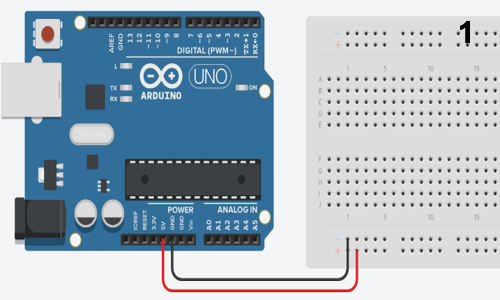
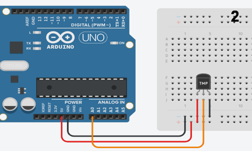
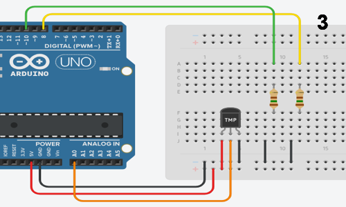
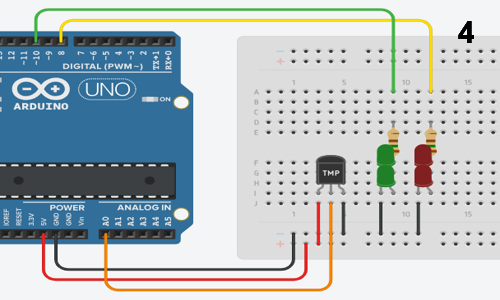
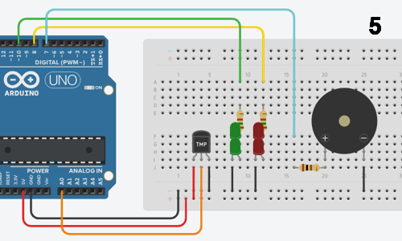
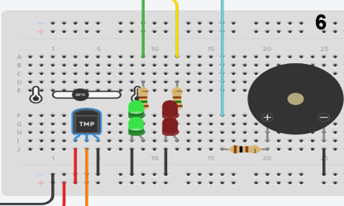
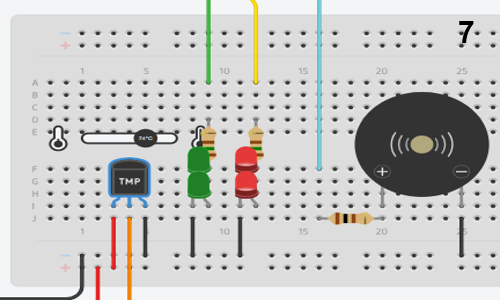

# Sensor de Temperatura N1

## Introducción:
En este proyecto, evaluaremos la funcionalidad de un sensor de temperatura utilizando Arduino. El objetivo es examinar su comportamiento bajo diferentes condiciones de temperatura.

## Materiales:
- Resistencias (2 de 150 ohm, 1 de 100 ohm)
- Sensor LM35 (sensor de temperatura con módulo)
- LEDs (2 verdes, 2 rojos)
- Buzzer
- Cables
- Protoboard
- Arduino Uno

## Resumen del Proyecto:
El proyecto, basado en Arduino Uno, incorpora LEDs verdes y rojos junto con un zumbador. En condiciones normales, cuando la temperatura se mantiene por debajo de un cierto umbral, los LEDs verdes permanecen iluminados. Sin embargo, cuando la temperatura supera el umbral predefinido, indicando un posible riesgo de incendio, los LEDs verdes se apagan mientras que los LEDs rojos se iluminan, acompañados de una alarma audible del zumbador.

## Repositorio en GitHub:
El repositorio del proyecto se encuentra en GitHub, donde se presenta una visión general concisa de los objetivos y la funcionalidad del proyecto. 

## Instrucciones de Montaje del Circuito:

A continuación se muestran los pasos para armar el circuito:

**Funcionamiento del circuito:**

